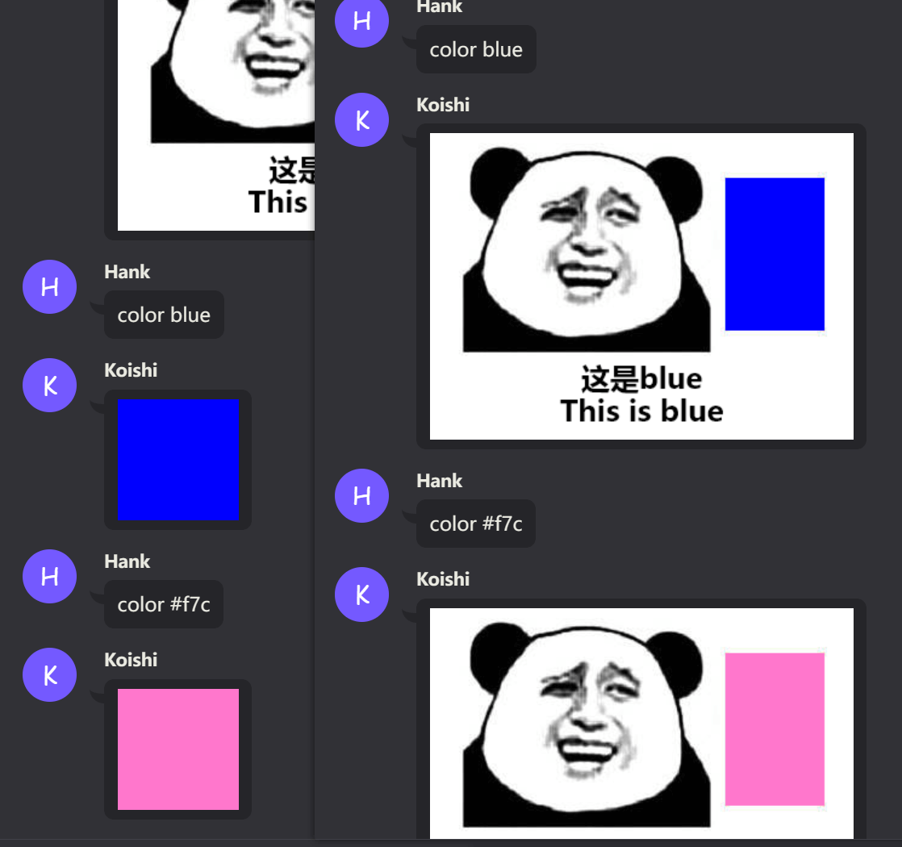
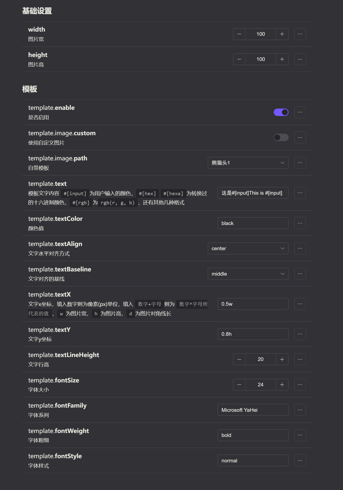

# koishi-plugin-give-you-some-color

使用了 [color - npm (npmjs.com)](https://www.npmjs.com/package/color) 库，输入的字符串由 [color-string - npm (npmjs.com)](https://www.npmjs.com/package/color-string) 库处理。

* 支持部分中文颜色，因为和英文[做了映射](./src/colors.ts)。
* 支持使用模板，详见下方示例和配置。

## 前置

- [ltxhhz/koishi-plugin-skia-canvas: 基于 skia-canvas 提供 koishi 的 skia 服务 (github.com)](https://github.com/ltxhhz/koishi-plugin-skia-canvas)

## 示例

## 配置

## 其他插件

* [ltxhhz/koishi-plugin-imagify-skia: koishi 插件，使用 skia-canvas 的图形化输出，性能优于 puppeteer (github.com)](https://github.com/ltxhhz/koishi-plugin-imagify-skia)
